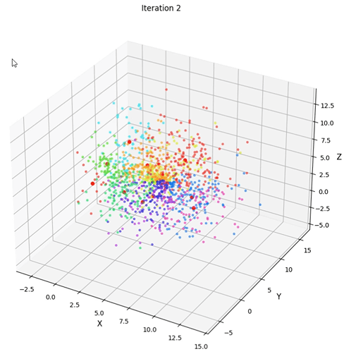

# 3D Cluster Visualizer

A Python-based tool for generating and visualizing 3D clusters using the K-Means algorithm. This tool allows you to create 3D coordinate blobs, apply the K-means clustering algorithm, and visualize the results in an interactive 3D plot with MatPlotLib.

## Features

- Generate random 3D data points.
- Apply the K-means clustering algorithm.
- Visualize clusters in 3D.
- Save and load data from CSV files.

## Installation

Install the necessary dependencies by running the following commands:

 
```bash
pip install pandas
pip install numpy
pip install matplotlib
```

## Use Cases:
When using the tool to test cluster amounts and data points per cluster, make sure to use reasonable upper and lower cluster centers. As you increase the lower and 
upper limits of clustering from centers of each other the faster K-Means is able to determine the clusters. To get a decent feel for the project try 10 clusters, 100 data points, from 1 - 5. Additionally the current color map is 'hsv' from MatPlotLib, if you wish to change the color, you can set it within the plot_cluster_3d to a more appropriate colormap for yourself.

## Example Plot:
<p align="center">
  
</p>

## Credit:
The project scope increased, and I was inspired to add a built-from-scratch K-Means clustering algorithm, thanks to the YouTube channel Dataquest. Please check them out for an in-depth and well-explained breakdown of how the K-Means algorithm works.


## Excerpt:
This project started as an exploration of Matplotlib, with the goal of creating a simple 3D scatter plot from x, y, and z coordinates. As the project progressed, I added more features, including K-means clustering and customization options. The project grew from a basic plotter into a tool for simulating and visualizing data clusters, improving with each iteration.

## Future Improvements:
- Load data from self submitted CSV file .
- Possible implimentation of Plotly with dash, mainly due to MatPlotLib not being as visually asthetic. 
- 2D overview to get a better idea of the K-Means algo. in action with original 3D.
- Cluster legend, and compare true cluster label to simulated clustering.
- Allow user to set standard deviation to increase the spread of points.
- Find better colormap that is more vivid from start to end but is not constrained by cluster amount.